# Icke-funktionella krav för Gomoku

Vilka egenskaper ett system behöver ha är väldigt viktigt för användarupplevelsen. Kraven är framtagna genom en intervju med kunden. Under intervjun ställdes frågor kring hur snabbt spelet ska fungera, vilka enheter kunden använder men även vad som händer om anslutningen till internet plötsligt försvinner. 

# Systemets icke-funktionella krav: 
| ID | KRAV | 
|-------|-------|
|NFR-01| Användarvänlighet: Spelet ska vara enkelt att förstå och använda även för en person utan teknisk kunskap|  
|NFR-02| Responsiv design:	Spelplan, knappar och information ska fungera och anpassas till mobil och dator.  |
|NFR-03| Prestanda: Spelet ska reagera snabbt på spelarens drag och inte kännas segt. |
|NFR-04| Anonym användning: Användaren ska kunna spela utan att skapa konto eller logga in. |
|NFR-05| Kompatibilitet: Spelet ska fungera på mobil och dator direkt i webbläsaren utan installation.|
|NFR-06| Anslutning via länk: Två spelare ska kunna spela tillsammans från samma eller olika platser.|
|NFR-07| Tillförlitlighet: Spelet ska kunna hantera tillfälligt internetavbrott utan att matchen förloras |
|NFR-08| Säkerhet och integritet: Personlig information ska inte krävas för att spela och ska inte finnas i inbjudningslänken. |
|NFR-09| Visuell stabilitet: Spelplanens storlek, position och även rutornas dimensioner ska fortsätta vara oförändrade när en sten placeras. Placera flera stenar och kontrollera att brädet inte krymper, flyttar sig eller ändrar storlek. |
|NFR-10| Säkerhet och integritet: En spelare ska kunna delta i en match utan att behöva lämna sina personuppgifter för att spela. |
|NRF-11|Brädans tillstånd ska vara konsekvent för båda spelarna i en match som sker på distans.|

## Internetavbrott 
| ID | KRAV |
|-------|-------|
|NRF-12| Ett tillfälligt internetavbrott ska inte automatiskt avsluta en pågående match som sker på distans mellan två spelare|
|NRF-13|När spelaren återansluter ska systemet alltid återställa den senaste giltiga spelstatus, tillstånd och turordning. (Om motståndaren inte har valt att avsluta matchen) |

## Anonymt spelande 
| ID | KRAV |
|-------|-------|
|NRF-14|Spelet ska alltid kunna användas direkt i en webbläsare utan att spelaren behöver installera något program|
|NRF-15|Spelet ska kunna användas på både datorer och mobiltelefoner|

```mermaid
flowchart TD

    A["Icke-funktionella krav för Gomoku"]

    A --> B["Systemets icke-funktionella krav"]

    B --> NFR01["NFR-01<br/>Användarvänlighet"]
    B --> NFR02["NFR-02<br/>Responsiv design"]
    B --> NFR03["NFR-03<br/>Prestanda"]
    B --> NFR04["NFR-04<br/>Anonym användning"]
    B --> NFR05["NFR-05<br/>Kompatibilitet"]
    B --> NFR06["NFR-06<br/>Anslutning via länk"]
    B --> NFR07["NFR-07<br/>Tillförlitlighet"]
    B --> NFR08["NFR-08<br/>Säkerhet och integritet"]
    B --> NFR09["NFR-09<br/>Visuell stabilitet"]
    B --> NFR10["NFR-10<br/>Säkerhet och integritet"]
    B --> NFR11["NFR-11<br/>Konsekvent brädstatus"]

    A --> C["Internetavbrott"]

    C --> NFR12["NFR-12<br/>Tillfälligt internetavbrott ska inte automatiskt avsluta matchen"]
    C --> NFR13["NFR-13<br/>Senaste giltiga spelstatus, tillstånd och turordning återställs vid återanslutning"]

    A --> D["Anonymt spelande"]

    D --> NFR14["NFR-14<br/>Spelet fungerar direkt i webbläsaren utan installation"]
    D --> NFR15["NFR-15<br/>Spelet fungerar på datorer och mobiltelefoner"]

    NFR01 --> T01["Enkel att förstå och använda"]
    NFR02 --> T02["Anpassas till mobil och dator"]
    NFR03 --> T03["Snabb respons på spelarens drag"]
    NFR04 --> T04["Ingen registrering eller inloggning"]
    NFR05 --> T05["Fungerar direkt i webbläsaren"]
    NFR06 --> T06["Två spelare kan spela via länk"]
    NFR07 --> T07["Matchen förloras inte vid tillfälligt internetavbrott"]
    NFR08 --> T08["Ingen personlig information krävs"]
    NFR09 --> T09["Spelplanens storlek och position är oförändrad"]
    NFR10 --> T10["Spelaren kan delta utan personuppgifter"]
    NFR11 --> T11["Samma brädstatus för båda spelarna"]

    NFR12 --> T12["Matchen fortsätter efter tillfälligt avbrott"]
    NFR13 --> T13["Matchens senaste giltiga tillstånd återställs"]

    NFR14 --> T14["Ingen programinstallation krävs"]
    NFR15 --> T15["Fungerar på både dator och mobil"]

    style A font-weight:bold
    style B font-weight:bold
    style C font-weight:bold
    style D font-weight:bold
```

