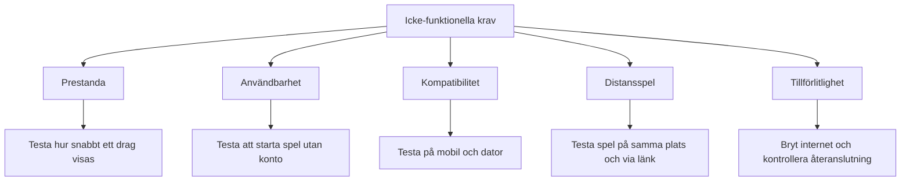

# Icke-funktionella krav för Gomoku

Vilka egenskaper ett system behöver ha är väldigt viktigt för användarupplevelse. Kraven är framtagna genom en intervju med kunden. Under intervjun ställdes frågor kring hur snabbt spelet ska fungera, vilka enheter kunden använder men även vad som händer om anslutningen till internet plötsligt försvinner. 

# Prestanda

## Frågan från intervjun: 
### vad hade fått dig att sluta spela spelet eller stör dig när du spelar vanligtvis?

### Kundens svar: Om det blev segt skulle jag nog bara stänga ner det, ärligt talat. Jag vill det ska kännas smidigt när jag spelar.

Krav:

Spelet ska reagera snabbt när användaren gör ett drag i Gomoku. Distansspel är extra viktig eftersom motspelarens drag ska visas utan fördröjning.


### Hur kravet kan testas?

För att testa kravet, gör ett drag på spelplanen sedan kontrollera att draget visas direkt. Vid distansspel kan två enheter användas samtidigt för att kontrollera att det inte finns fördröjning mellan varje dag. 


# Användbarrhet

## Frågan från intervjun med Ai kunden:
### Vill du behöva logga in på eget konto innan du börjar spela eller vad föredrar du?

### Kundens svar till frågan: Nej, Helst inte. Jag glömmer lösenord hela tiden, så om jag måste skapa ett konto kanske jag bara struntar i det.

Krav: Användaren vill kunna starta och spela en match utan att behöva skapa konto eller logga in.


### Hur kan man testa denna krav?

Öppna spelet som en ny användare och kontrollera att det går att starta en match utan att du behöver registrering eller inloggning. 


# Kompatibilitet

## Frågan från intervjun med kunden:
### Vad brukar du vanligtvis spela Gomoku på? Har du olika enheter? 

### Kundens svar: Jag brukar spela på en samsung-telefon och en vanlig Windows laptop. Chrome, tror jag-den med den frågade cirkeln

Krav: Systemet ska fungera på både mobiltelefon men även datorer och ska kunna spelas direkt i en webbläsare utan installation. 


### Hur kan vi testa kravet?

Testa först att spela Gomoku på en samsung telefon, sedan testa windows dator. Kontrollera även att spelet fungerar i en modern webbläsare som chrome, och att spelplanen är användbar på båda enheterna.


# Kompatibilitet mellan olika enheter; 

## frågan från intervjun: Spelar det roll för dig om din vän spelar från en annan enhet eller funkar vad som helst?
### Svaret från kunden: En kompis har en Iphone, men jag vet inte om det spelar någon roll. Jag skulle bara vilja att vi kan spela mot varandra utan att behöva krångla med en massa inställningar.

Krav: En annan spelare ska kunna ansluta till spelet utan problem även om personen använder en annan typ av enhet än samsung. 

### Hur kan kravet testas?

Starta en match på en Android telefon sedan kontrollera att en annan spelare med till exempel iPhone kan spela samma match. 


# Distansspel och anslutningen (länk)

## frågan från intervjun: Om du spelar med dina vänner, hur brukar ni köra med varandra?
### Svaret: Oftast är det en kompis som spelar med mig. Ibland sitter vi bredvid varandra i soffan, och ibland är kompisen hemma hos sig.

Krav: Systemet ska fungera när två personer kör från samma ställe eller om det spelar från olika platser

### Hur det testas?
Testa en match med två personer som använder samma enhet och en annan där två personer använder varsin enhet och använder en länk för att anluta till en match. 

# Tillförlitlighet

## Frågan från intervjun: Vad har du känt ifall internet anslutningen plöstligt försvann?
### Svaret från kunden: Det händer ibland att internet försvinner en stund, typ när mikron är igång då skulle jag helst slippa börja om hela spelet från början. 

Krav: Systemet ska kunna hantera tillfälliga problem som till exempel internetanslutning. Om anslutningen bryts ska användaren informeras och kunna fortsätta spela när anslutningen återställs, om det är möjligt.

### Hur kan kravet testas?
Stäng av internetanslutningen under en match sedan kontrollera hur systemet reagerar. Återanslut och kontrollera om matchen kan fortsättas utan att spelets tillstånd förloras helt. 


# Sammanfattning:
Intervjun med kunden användes för att identifiera många icke-funktionella krav som är viktiga för kunden utan att kunden är medveten om det. Genom att exempelvis utgå från prestanda, enheter, internetanslutningg och användarensbehov kunde de icke-funktionella kraven tas fram utan onödiga frågor. 

Ett krav är när en förväntning på systemet som går att testa, och kraven kan testas genom olika praktiska tester, till exempel genom att använda olika enheter, stänga av internet under en pågående match eller kontrollera hur snabbt spelet reagerar efter ett drag. 


```

