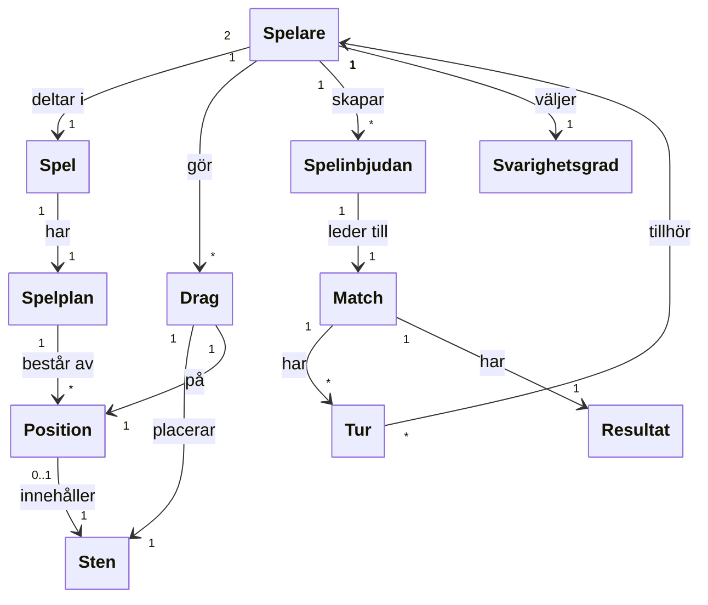

# Begreppsmodell

## Följande begrepp är viktiga för Gomoku och har en relation till spelets funktion:

 1. Sten
 2. Spelplan
 3. position
 4. Spelare
 5. Spel
 6. Match
 7. Drag
 8. Tur
 9. Resultat
 10. Spelinbjudan
 11. Svårighetsgrad

## Relationer för dem olika begreppen kan bland annat vara:

- En spelare deltar i ett Gomoku spel
- En match har ett spelbräde.
- Ett Gomoku spel har en spelplan att spela på
- En spelplan består av olika positioner
- En spelare gör ett drag mot sin motståndare 
- Ett drag placerar en sten från en position till en annan.
- En Gomoku match har olika turer mellan varandra.
- En tur tillhör endast en spelare.
- Ett spel avslutas och visar ett resultat på vinst, förlust eller oavgjort.
- En spelare kan skapa en spelinbjudan för att bjuda in en annan spelare.
- En spel inbjudan leder till en match.
- En spelare kan välja svårighetsgrad när motståndaren är datorns AI. 

