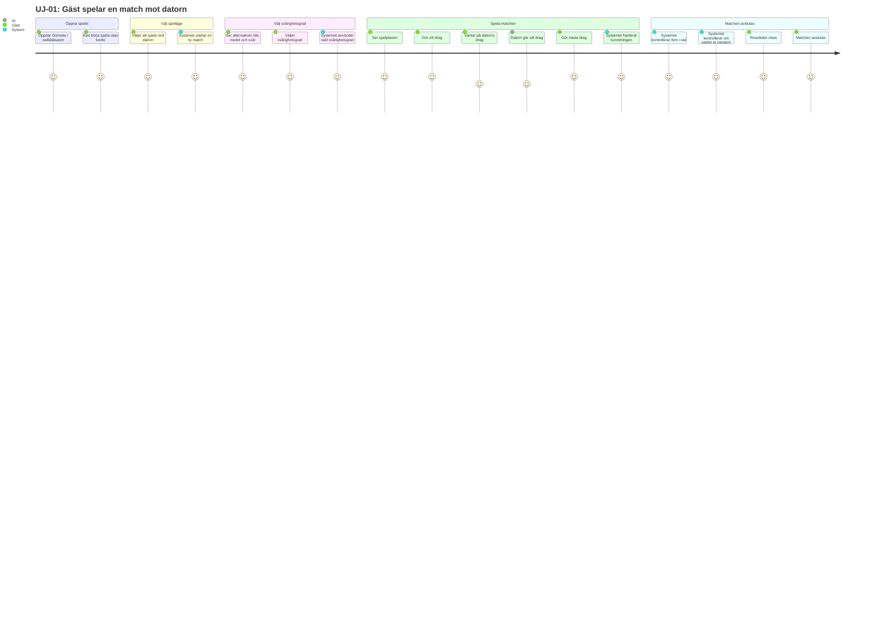
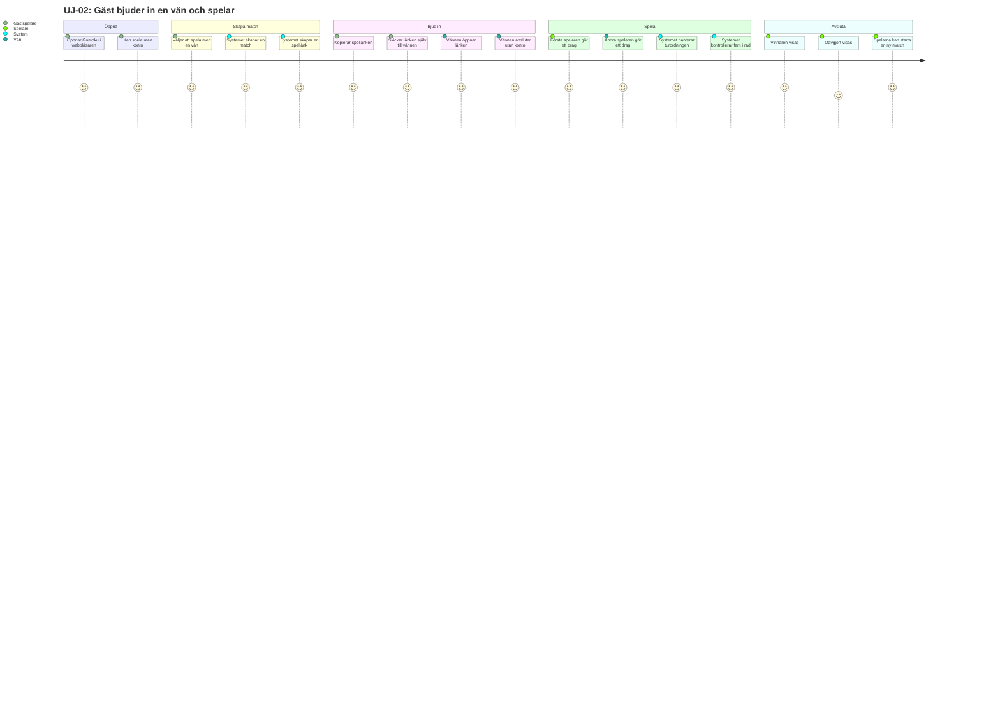
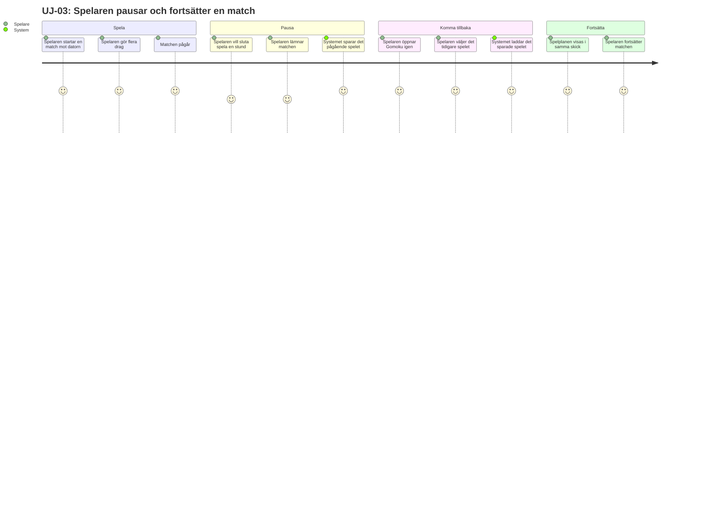

# User Journey - Gomoku
## Kort översikt:
Nedan finns User journeys som beskriver hur en användare upplever och interagerar med systemet från början till slut när användaren försöker att uppnå ett specifikt mål i systemet. 

Följande User journeys för Gomoku har tagits fram för att representera de viktigaste sätten som spelet används på:

* UJ-01: En gäst spelare som spelar mot dator
* UJ-02: En spelare som bjuder in en vän
* UJ-03: Spelare återupptar en pågående match.

Det som framför allt visas är användarens aktiviteter, systemets aktiviteter och användarens förväntade upplevelse under de olika stegen som sker i systemet
  
# UJ-01-Gäst spelare kör mot datorn
### Aktör: En gäst spelare
## Mål: Spelaren vill kunna köra en Gomoku match mot datorn samt kunna vinna, förlora eller spela oavgjort. 

# UJ-02 – spela med vän i Gomoku
### Aktör: En gäst spelare
### Sekundär aktör: En vän
## Mål: Spelaren vill kunna starta en Gomoku-match med sin vän genom att dela en spellänk.

# UJ-03 – pausa och fortsätta en match
### Aktör: En spelare
## Mål: Spelaren vill kunna lämna ett pågående spel och fortsätta det senare från samma läge.

# 
