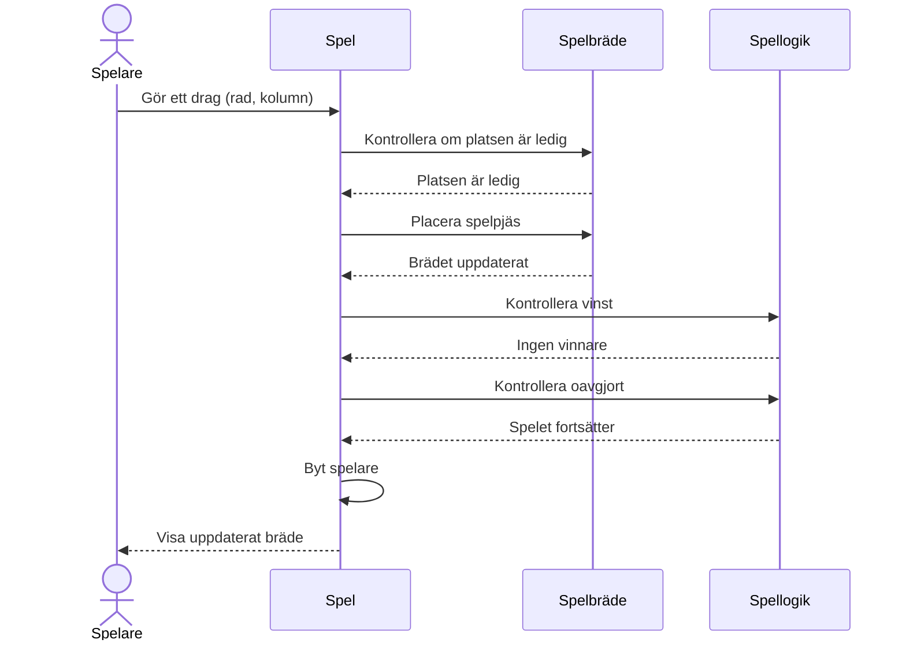

# Sekvensdiagram för gomoku

#### Man utgår från centrala flödet genom att spelare gör först ett drag > Systemet validerar > brädet uppdateras > spelet kontrollerar om det blev vinst eller oavgjort > nästa spelare ifall ingen har vunnit. 

