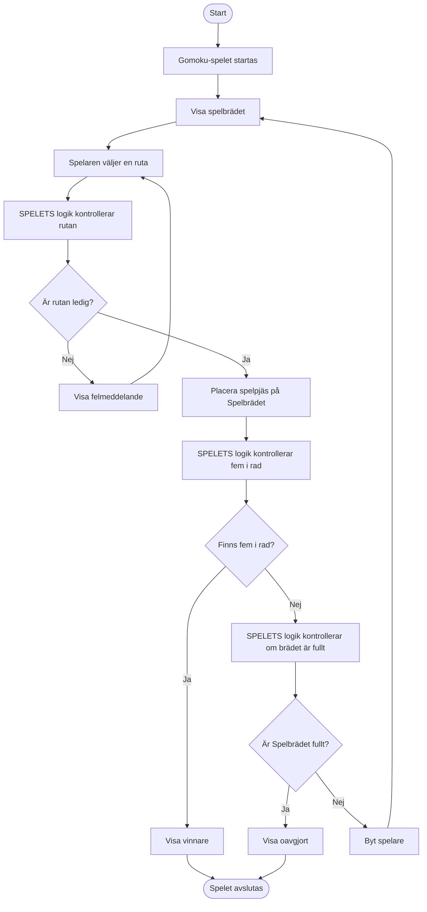

# Aktivitetsdiagram för gomoku

#### Här är det viktigt att visa både ogiliga och giltiga drag men även vinst,oavgjort och nästa tur. 
#### Use case > testfall: verifierar att systemets funktion uppfyller kravet/scenariot som finns i dem olika UC.
#### Aktivitetsdiagram > testfall: Hjälpte oss hitta flöden/alternativa vägar och edge cases som kanske inte är tydliga i våra UC

