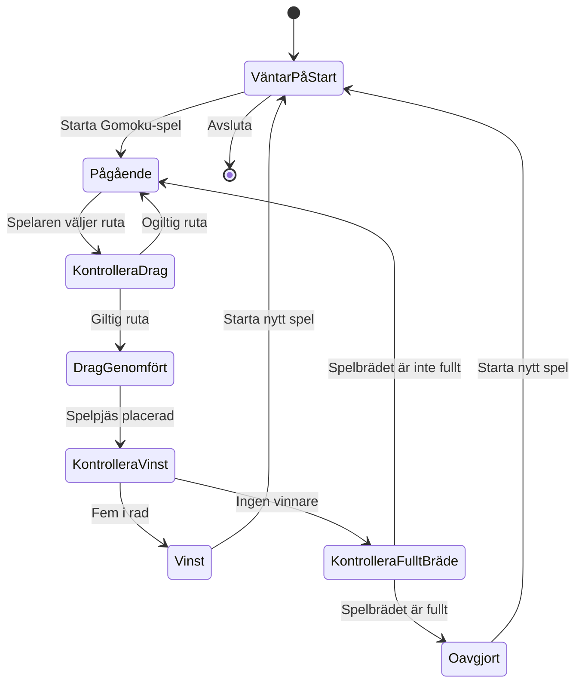

# Tillståndsdiagram - Gomoku

Här fokuserar vi mer på spelets livscykel, alltså inte varje intern metod utan bara olika tillstånd som systemet kan befinna sig som går att verifiera genom olika testfall.

